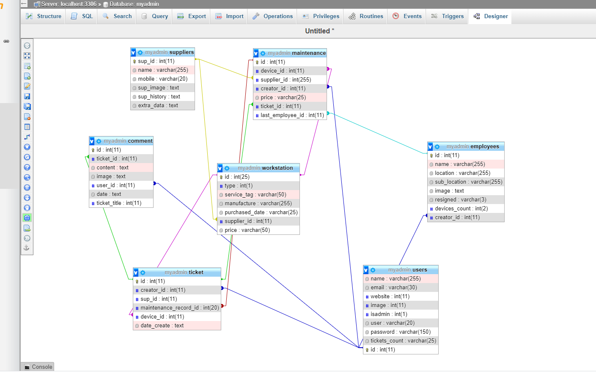
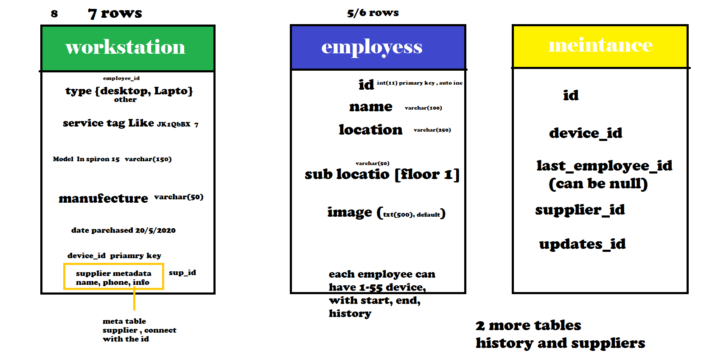
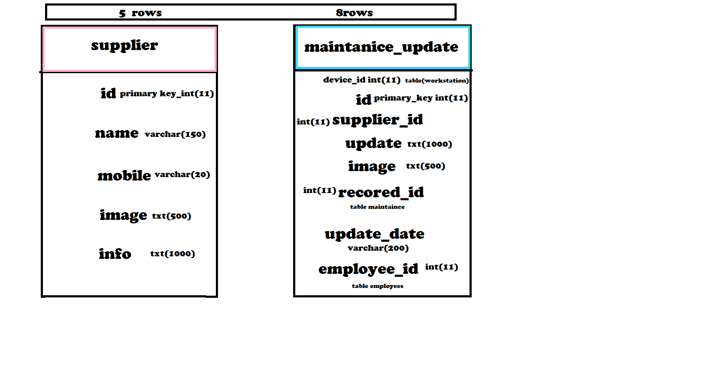
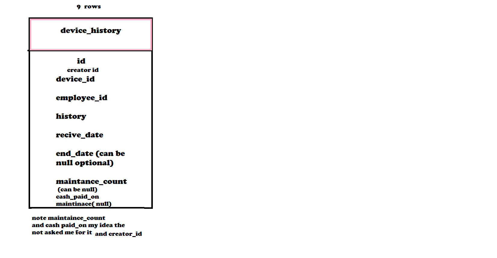

# Real_Project-PHP-

```
SELECT * FROM `ticket` WHERE 1
```

Localhost APP for my Company EEC Group

# This gonna be number 1 php store_system wrriten 
second time use planning becuase it worth  they said(30days) I will finish it in less than 7days with ultra secure  


use PHP and MYSQL, to create system can store devices, employee, suppliers, maintenance, and maintenance updates, with relationa database, senor quit today and i have to be senior php and mysql with 13 days, lets try build awesome app system no one made better than it with 13days php exp




#database first was only 3 tables




1more last table 

# device_history

last table users and all needed for secure login

https://itsourcecode.com/free-projects/php-project/secure-login-page-using-phpmysql/

configure computer to work as server, or host my app localy for the company
http://na.support.keysight.com/materials/help/85071webhelp/Configure_PC_to_Analyzer_using_Crossover_LAN.htm

### Great_script
https://code.tutsplus.com/articles/20-useful-php-scripts-available-on-codecanyon--cms-25584

On the PC, click Start, then Control Panel, then Network Connections.
Click Local Area Connection.
In the dialog box,, click on Properties.
Select Internet Protocol(TCP/IP) then click Properties.
Select Use the following IP address.
Enter an IP address and Subnet mask. For example:
